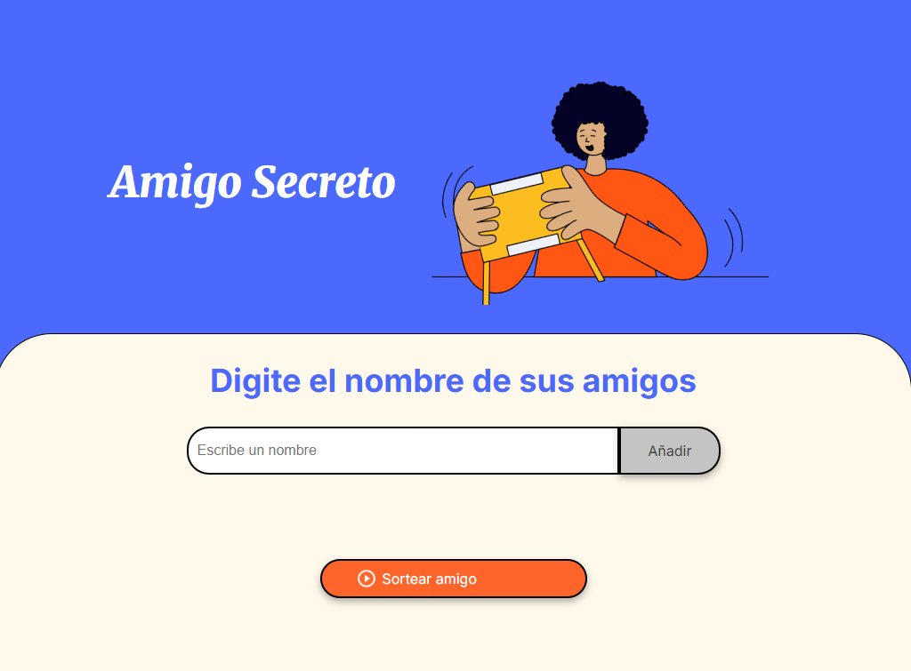
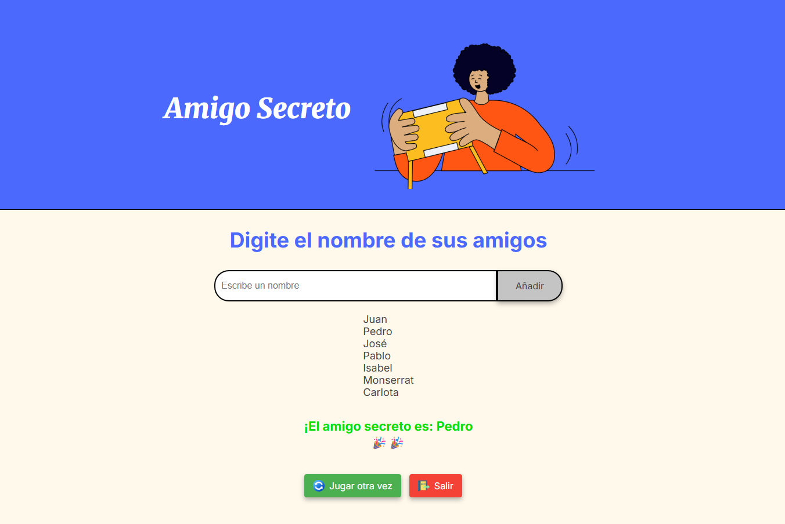

# 🎄 Amigo Secreto - Aplicación Web

Aplicación web interactiva para realizar sorteos de "Amigo Secreto" de manera fácil y divertida.

## 🚀 Características principales

- ✨ **Interfaz intuitiva** con diseño atractivo
- 📝 **Agregar participantes** con validación inteligente
- 🔄 **Reiniciar juego** para múltiples sorteos
- 🎯 **Sorteo aleatorio** justo y transparente
- 🛡️ **Validaciones robustas**:
  - No permite nombres vacíos
  - Detecta duplicados (insensible a mayúsculas/minúsculas)
  - Filtra caracteres especiales no permitidos
  - Limita a 30 caracteres por nombre

## 🛠️ Tecnologías utilizadas

- 
 
 

## 📦 Estructura del proyecto
+ amigo-secreto/
    + ├── index.html # Estructura principal
    + ├── style.css # Estilos visuales
    + ├── app.js # Lógica de la aplicación
      + └── assets/
    + ├── amigo-secreto.png # Imagen principal
    + ├── play_circle_outline.png # Ícono de sorteo
    + ├── refresh.png # Ícono de reinicio
    + └── exit.png # Ícono de salida
## 🖥️ Cómo usar

1. **Agregar participantes**:
   - Escribe el nombre en el campo de texto
   - Haz clic en "Añadir" o presiona Enter

2. **Realizar sorteo**:
   - Cuando tengas todos los nombres, haz clic en "Sortear amigo"
   - ¡Descubre quién es el Amigo Secreto!

3. **Opciones posteriores**:
   - "Jugar otra vez" → Reinicia el juego
   - "Salir" → Finaliza la aplicación

## 🌟 Funcionalidades destacadas

```javascript
// Capitalización automática de nombres
function capitalizarNombre(nombre) {
    return nombre.charAt(0).toUpperCase() + nombre.slice(1).toLowerCase();
}

// Validación de duplicados insensible a mayúsculas
function nombreExiste(nombre) {
    return listaAmigos.some(n => n.toLowerCase() === nombre.toLowerCase());
}
```
# 📌 Requisitos
Navegador web moderno (Chrome, Firefox, Edge, Safari)

Conexión a Internet (solo para cargar fuentes Google)

# 🎨 Preview

*Pantalla principal donde ingresas nombres*
  
*Resultado del sorteo mostrando el amigo secreto*
# 🤝 Contribuciones
Las contribuciones son bienvenidas. Por favor:

+ Haz un fork del proyecto

- Crea una rama con tu feature (git checkout -b feature/AmazingFeature)

- Haz commit de tus cambios (git commit -m 'Add some amazing feature')

- Haz push a la rama (git push origin feature/AmazingFeature)

- Abre un Pull Request


✉️ Contacto: 
Héctor José Pacheco Hernández - pephdz@outlook.es

Enlace del proyecto: https://github.com/pephdz/amigo-secreto# 
